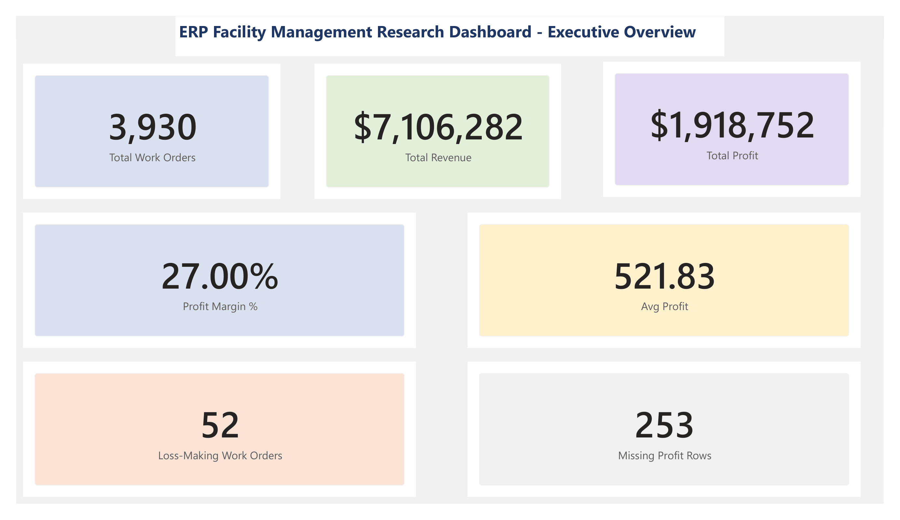
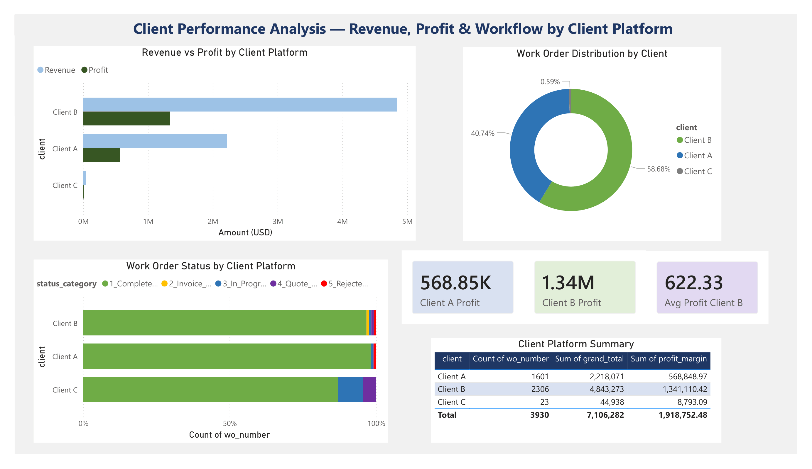
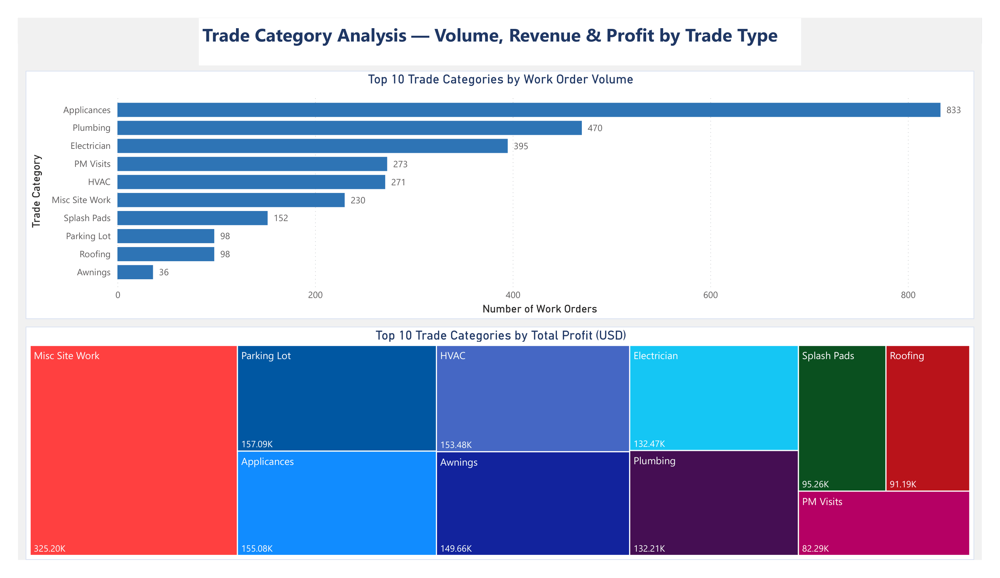
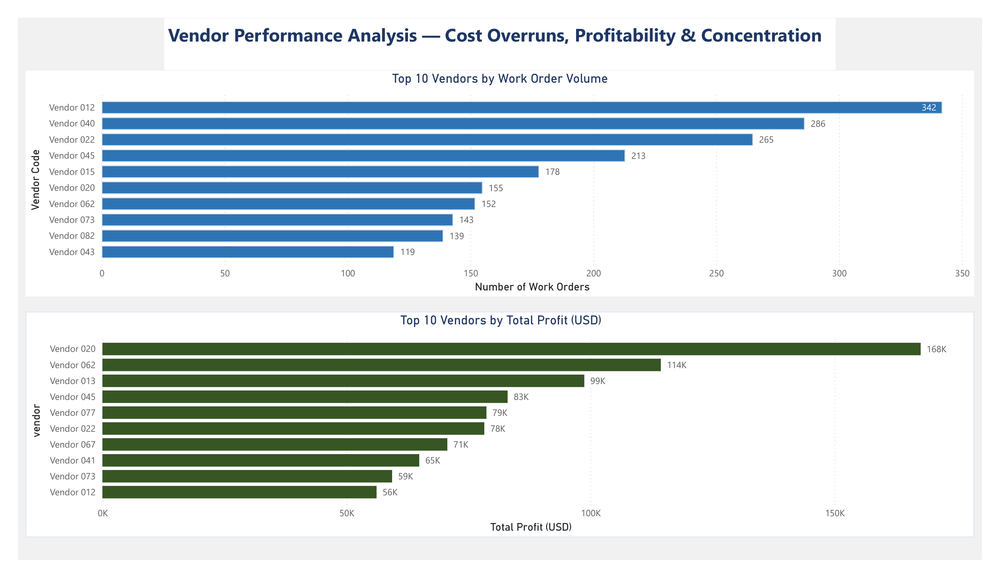
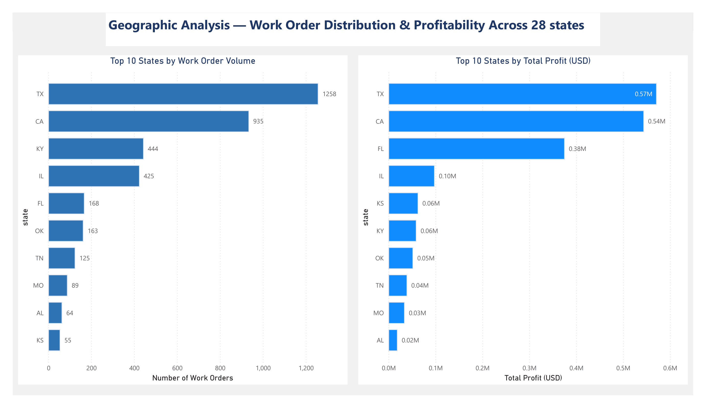
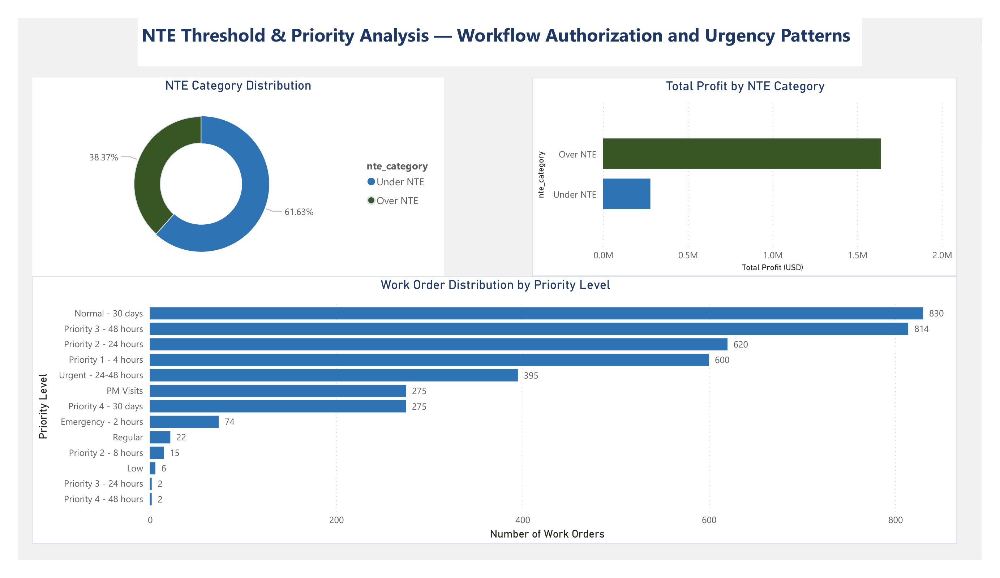

# ERP Facility Management Research

## Multi-Platform ERP Navigation in Facility Management Contracting

## Paper Title

Multi-Platform ERP Navigation in Facility Management Contracting: An Empirical
Mixed-Methods Analysis of Invoice Rejection Drivers, Operational Inefficiencies,
and Compensatory Workarounds Using SQL Analytics and Power BI Visualization

## Author

**Venkata Sai Krishna Baggu**
MS Engineering Management, University of North Texas
Facility Management Industry Practitioner
GitHub: [@bvskrishna3137](https://github.com/bvskrishna3137)
LinkedIn: [saikrishna30](https://www.linkedin.com/in/saikrishna30)

## Journal Target

Journal of Facilities Management (Emerald Publishing)
ISSN: 1472-5967 (Print) | ISSN: 1741-0983 (Online)
Status: Under Review (2026)

---

## Key Research Findings

| Finding | Value |
|---|---|
| Total Work Orders Analyzed | 3,930 |
| Observation Period | March 2025 — March 2026 |
| Total Revenue | $7,106,282 |
| Total Profit | $1,918,752 |
| Average Profit per Work Order | $521.83 |
| Overall Profit Margin | 27.0% |
| Over NTE vs Under NTE Profit Ratio | 9.4x |
| Loss-Making Work Orders | 52 (1.3%) |
| Geographic Coverage | 28 US States |
| Unique Vendors | 217 (anonymized) |
| Unique Trade Categories | 47 |
| Data Cleaning Steps | 41 documented steps |

---

## 📊 Research Dashboards

> All dashboards built using Microsoft Power BI Desktop.
> Dataset: 3,930 work orders | Period: March 2025 — March 2026

---

### Figure 1 — Executive Overview Dashboard

*Seven KPI cards: total work orders (3,930), revenue ($7,106,282),
profit ($1,918,752), avg profit/WO ($521.83), margin (27%), losses (52), missing (253)*

---

### Figure 2 — Client Performance Analysis

*Revenue vs profit by client platform. Client B generates 64% higher
profit per work order than Client A ($582 vs $355)*

---

### Figure 3 — Trade Category Analysis

*Top 10 trades by volume (Appliances: 833 WOs) and profit
(Misc Site Work: $325,200) — revealing inverse volume-profit relationship*

---

### Figure 4 — Vendor Performance Analysis

*Top 10 vendors by volume and profit across 217 anonymized vendors.
Highest volume vendor ranks 10th in profit — volume-profitability paradox*

---

### Figure 5 — Geographic Distribution Analysis

*Top 10 states by volume (Texas: 1,258 WOs, 32%) and profit.
Florida generates $2,235/WO — 4.3x the company average*

---

### Figure 6 — NTE Threshold and Priority Analysis

*NTE distribution (Under: 61.63%, Over: 38.37%). Over NTE jobs generate
9.4x more profit per work order than Under NTE jobs*

---

## Repository Structure
ERP-FacilityManagement-Research/
├── 01_Paper/          # Full research paper and cover letter
├── 02_Data/           # Data dictionary and cleaning log
├── 03_SQL/            # Database schema and 10 research queries
├── 04_PowerBI/        # Power BI dashboard documentation
├── 05_Figures/        # 6 dashboard PNG images and PDF export
└── 06_References/     # Complete APA 7th edition reference list
---

## Technology Stack

| Tool | Purpose |
|---|---|
| Microsoft Excel | Data cleaning (41-step protocol) |
| PostgreSQL 18 | Relational database |
| pgAdmin 4 | Database management |
| Microsoft Power BI | Data visualization (6 dashboards) |
| SQL | Quantitative analysis (10 queries) |
| Git & GitHub | Version control and data availability |

---

## Data Privacy Statement

All organizational identifiers have been fully anonymized:
- Client names → Client A, Client B, Client C
- Vendor names → Vendor 001 through Vendor 217
- Manager names → Manager 01 through Manager 12
- Platform names → generic descriptions only

The anonymization mapping document is maintained separately
and is not publicly available per organizational consent agreement.

---

## Citation

Baggu, V. S. K. (2026). Multi-platform ERP navigation in facility
management contracting: An empirical mixed-methods analysis of invoice
rejection drivers, operational inefficiencies, and compensatory
workarounds using SQL analytics and Power BI visualization.
*Journal of Facilities Management*.

---

## Contact

**Venkata Sai Krishna Baggu**
GitHub: [@bvskrishna3137](https://github.com/bvskrishna3137)
LinkedIn: [saikrishna30](https://www.linkedin.com/in/saikrishna30)
